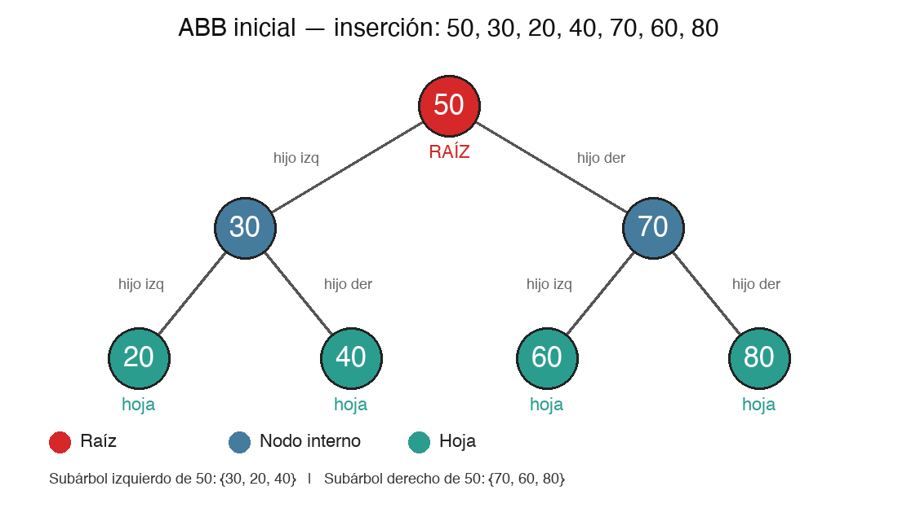
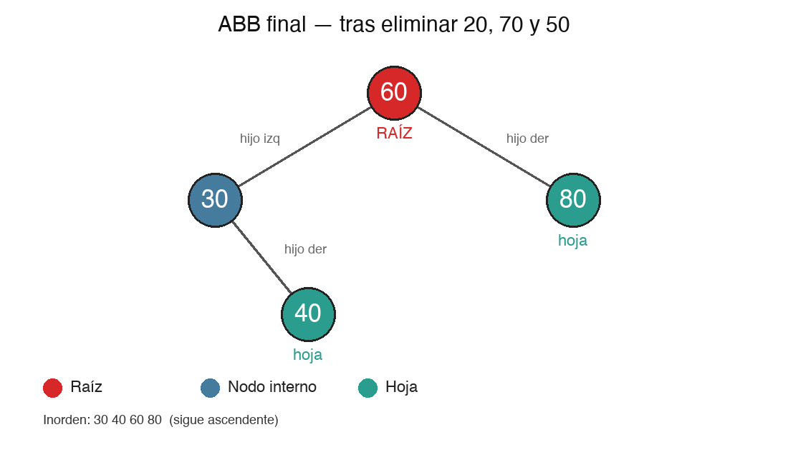
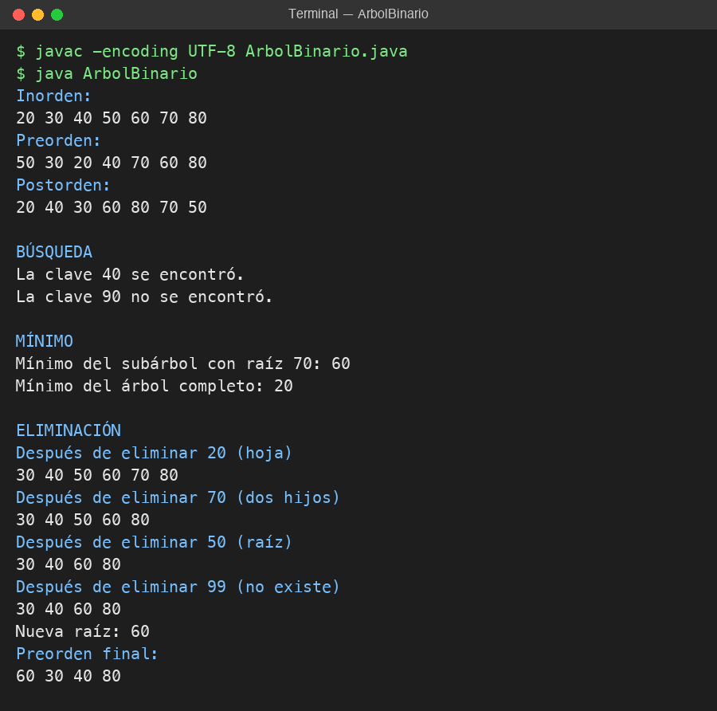

# Actividad: Árbol Binario de Búsqueda (ABB)

En esta actividad completé los métodos de búsqueda, eliminación y el método auxiliar para encontrar el mínimo en un árbol binario de búsqueda en Java. Abajo están el dibujo del árbol, el código, las capturas de las pruebas y las respuestas a las preguntas.

Para correrlo:

```
javac ArbolBinario.java
java ArbolBinario
```

## 1. Dibujo del árbol

Insertando en este orden: 50, 30, 20, 40, 70, 60, 80



```
          50        <- raíz
        /    \
      30      70
     /  \    /  \
   20   40  60   80   <- hojas
```

- Raíz: 50
- Hijos de 50: izquierdo 30, derecho 70
- Hijos de 30: izquierdo 20, derecho 40
- Hijos de 70: izquierdo 60, derecho 80
- Hojas: 20, 40, 60 y 80

## 2. ¿Qué propiedad debe cumplir todo ABB?

Que para cada nodo, todo lo que está en su subárbol izquierdo es menor y todo lo que está en el subárbol derecho es mayor. Y esto se tiene que cumplir en todos los nodos, no solo en la raíz.

## 3. ¿Cuál es la raíz?

El 50, porque fue el primero que se insertó.

## 4. ¿Qué nodos son hojas?

20, 40, 60 y 80, porque no tienen hijos.

## 5. Subárbol izquierdo y derecho de 50

- Izquierdo: 30, 20 y 40 (todos menores que 50)
- Derecho: 70, 60 y 80 (todos mayores que 50)

## 6. ¿Qué secuencia da el inorden?

20 30 40 50 60 70 80

O sea, quedan ordenados de menor a mayor.

## 7. Método de búsqueda

```java
private boolean buscarRec(Nodo raiz, int clave) {
    if (raiz == null) return false;          // no está
    if (clave == raiz.clave) return true;    // la encontré
    if (clave < raiz.clave)
        return buscarRec(raiz.izquierdo, clave);  // busco a la izquierda
    return buscarRec(raiz.derecho, clave);        // busco a la derecha
}
```

**¿Por qué no hay que recorrer todos los nodos?**
Porque en cada nodo ya sé para qué lado ir. Si la clave es menor voy a la izquierda y si es mayor a la derecha, entonces el otro lado ni lo miro. Solo recorro un camino de arriba hacia abajo.

**Si busco 40, ¿qué nodos visito?**
50, después 30 y después 40. Como 40 es menor que 50 voy a la izquierda, como es mayor que 30 voy a la derecha, y ahí está.

**Si busco 90, ¿cómo sé que no existe?**
Recorro 50, 70 y 80. Como 90 es mayor que 80 intento ir a la derecha de 80, pero ahí no hay nada (es null). Cuando llego a null sé que no existe.

**¿Qué devuelve el caso base cuando el nodo es null?**
false, porque si no hay nodo no puede estar la clave.

**¿Qué pasaría si el árbol no respetara la regla de menores a la izquierda y mayores a la derecha?**
La búsqueda podría irse para el lado equivocado y decir que la clave no está aunque sí esté. Para estar seguro habría que revisar todos los nodos y ya no tendría sentido usar un ABB.

## 8. Método de eliminación

```java
private Nodo eliminarRec(Nodo raiz, int clave) {
    if (raiz == null) return null;  // no existe, no hago nada

    if (clave < raiz.clave) {
        raiz.izquierdo = eliminarRec(raiz.izquierdo, clave);
    } else if (clave > raiz.clave) {
        raiz.derecho = eliminarRec(raiz.derecho, clave);
    } else {
        // lo encontré
        // si es hoja o tiene un solo hijo
        if (raiz.izquierdo == null) return raiz.derecho;
        if (raiz.derecho == null) return raiz.izquierdo;

        // si tiene dos hijos: pongo el menor del lado derecho
        raiz.clave = minimoValor(raiz.derecho);
        // y borro ese valor de donde estaba
        raiz.derecho = eliminarRec(raiz.derecho, raiz.clave);
    }
    return raiz;
}
```

Lo que pasó en las pruebas:
- Eliminar 20 (hoja): se borra directo. Queda 30 40 50 60 70 80
- Eliminar 70 (dos hijos): se reemplaza por 80, que es el menor de su lado derecho. Queda 30 40 50 60 80
- Eliminar 50 (la raíz, con dos hijos): se reemplaza por 60. Queda 30 40 60 80 y la nueva raíz es 60
- Eliminar 99 (no existe): el árbol queda igual

Así quedó el árbol al final:



**¿Por qué eliminar tiene más casos que buscar?**
Porque buscar solo mira y no cambia nada. Al eliminar tengo que sacar el nodo y además acomodar el árbol para que no se pierdan nodos y siga ordenado, y eso cambia según si el nodo tiene 0, 1 o 2 hijos.

**¿Qué pasa si la clave que quiero eliminar no existe?**
No debería pasar nada. La recursión llega a null, devuelve null y el árbol queda igual. Lo probé con el 99.

**¿Por qué eliminar una hoja es lo más fácil?**
Porque no tiene hijos, así que no hay nada que reacomodar. El padre deja de apuntarla (queda en null) y listo.

**Si el nodo tiene un solo hijo, ¿por qué se puede devolver ese hijo directamente?**
Porque ese hijo y todo lo que tiene abajo ya están del lado correcto respecto al padre. Entonces el hijo simplemente sube y ocupa el lugar del nodo que borré.

**¿Por qué el menor del subárbol derecho sirve para reemplazar un nodo con dos hijos?**
Porque es el número que sigue en orden. Es más grande que todo lo de la izquierda y más chico que todo lo demás de la derecha, entonces al ponerlo en ese lugar el árbol sigue ordenado. Además ese nodo nunca tiene hijo izquierdo, así que después es fácil borrarlo.

**Después de copiar el valor, ¿por qué hay que borrarlo de donde estaba?**
Porque si no, el número quedaría repetido dos veces en el árbol.

**¿Qué pasa si elimino un nodo con dos hijos y no reconecto bien los subárboles?**
Se puede perder una parte del árbol, porque nadie la apuntaría. También se podría desordenar y la búsqueda dejaría de funcionar bien.

**¿Por qué eliminar la raíz puede cambiar la variable raiz?**
Porque la raíz no tiene padre. Si la borro, otro nodo tiene que pasar a ser la raíz. Por eso en eliminar() se hace `raiz = eliminarRec(raiz, clave)`. En mi prueba, cuando borré el 50 la raíz pasó a ser el 60.

**¿Qué propiedad debe seguir cumpliendo el árbol después de eliminar?**
La misma del ABB: menores a la izquierda y mayores a la derecha. Lo comprobé con el inorden, que siempre siguió saliendo ordenado.

## 9. Método auxiliar: encontrar el mínimo

```java
private int minimoValor(Nodo raiz) {
    Nodo actual = raiz;
    while (actual.izquierdo != null)
        actual = actual.izquierdo;
    return actual.clave;
}
```

**¿Hacia dónde hay que moverse?**
Siempre a la izquierda, porque ahí están los más chicos.

**¿Cómo sé que ya encontré el mínimo?**
Cuando el nodo ya no tiene hijo izquierdo.

**¿Cuál es el mínimo del subárbol con raíz 70?**
60. Desde el 70 voy a la izquierda, llego al 60 y como no tiene hijo izquierdo ese es el mínimo.

## 10. Reflexiones finales

**¿Cómo ayuda el inorden a comprobar que el ABB está bien?**
Porque si el árbol está bien armado, el inorden siempre muestra los números ordenados de menor a mayor. Después de cada eliminación imprimí el inorden y como seguía ordenado supe que el árbol estaba bien.

**El caso de eliminación que me pareció más difícil**
El de dos hijos. Al principio no entendía qué hacer, porque si borras el nodo te quedan dos subárboles sueltos y el padre solo puede apuntar a uno. Lo que se hace es no borrar el nodo en sí, sino cambiarle el valor por el menor de su lado derecho y después borrar ese otro nodo, que es más fácil porque tiene como mucho un hijo.

**¿Qué papel cumple la recursividad?**
Como cada subárbol también es un árbol, puedo usar el mismo método para cada lado. En la búsqueda voy bajando hasta encontrar la clave o llegar a null. En la eliminación, además, cada llamada devuelve el nodo que tiene que quedar en ese lugar, y así el árbol se va reconectando solo cuando vuelve la recursión.

**¿Qué aprendí sobre el cambio de referencias?**
Que eliminar un nodo en realidad es dejar de apuntarlo. Lo importante es asignar bien lo que devuelve el método (`raiz.izquierdo = ...` o `raiz.derecho = ...`), porque si me olvido de una asignación se pierde parte del árbol.

**¿Cómo le explicaría a un compañero la diferencia entre buscar y eliminar?**
Le diría que buscar es solo bajar por el árbol eligiendo izquierda o derecha hasta encontrar el número o llegar a un lugar vacío, sin tocar nada. Eliminar empieza igual porque primero hay que encontrarlo, pero después hay que arreglar el árbol: si es hoja se saca, si tiene un hijo ese hijo sube, y si tiene dos se reemplaza por el menor de la derecha.

## 11. Capturas de las pruebas


